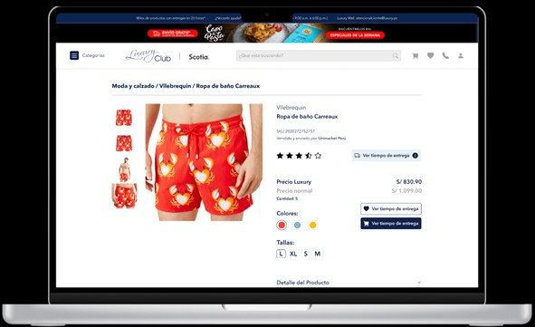
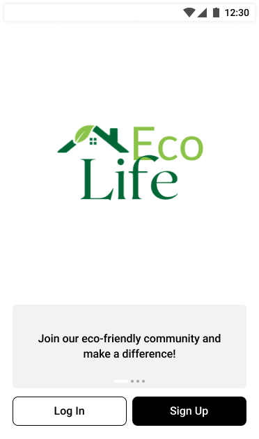

# 👋 Hi, I'm Adrian Tudela   
### **Business Analyst | Project Manager**  
📍 *Vancouver, BC* | ✉️ *atudela97@gmail.com* | 🌐 *Adrian Tudela(https://www.linkedin.com/in/adrian-tudela-166644161/)*  

---

## 🚀 **About Me**  
Passionate about bridging gaps between data and decision-making, I leverage **Jira**, **Trello**, **SQL**, and **PowerBI** to deliver actionable insights. With a knack for visualization (Figma, PowerBI) and automation (Python, JS), turning chaos into structured workflows that optimize processes drives me to keep improving. I have a Master's in Business Administration and Bachelor`s degree in industrial engineering with 3+ years of experience in product/project management, business planning, acquisitions, and logistics. I acquired knowledge in finance management, merchandising and business analytics.  

---

## 🛠 **Skills & Tools**  

### **Project Management**  


### **Data & Analytics**  


### **Design & Development**  


---

## 📂 **Figma Projects**  
*(Click thumbnails to view live prototypes)*  

| Project | Description | Preview |
|---------|-------------|---------|
| **[Ecommerce Product](https://www.figma.com/proto/RiQJEmZVTjdg1iAwUbKOrJ/Mejoras-Backlog_Luxury_2022?node-id=2937-23146&starting-point-node-id=2937%3A23146&t=ElQYiE2WJvzDi75h-1)** | Interactive ecommerce webpage for clients and stakeholders |  |
| **[EcoLife Mobile App](https://www.figma.com/proto/VNdjXLseY51CGYIXsgAfID/Untitled?page-id=0%3A1&node-id=3-519&viewport=511%2C871%2C0.15&t=Szm8UdVPxKhoAP9q-1&scaling=min-zoom&content-scaling=fixed&starting-point-node-id=3%3A519&show-proto-sidebar=1)** | UX/UI workflow for an mobile application |  |

*(Replace links/image paths with your actual Figma projects. Upload images to your repo’s `/images` folder.)*  

---

## 📊 **Data & Reports**  
**PowerBI Samples**  
- [Sales Performance Dashboard](https://github.com/.../sales-dashboard.pbix)  
- [Customer Segmentation Analysis](https://github.com/.../segmentation-report.pdf)  

**SQL Snippets**  
```sql
-- Example: Customer Retention Query
SELECT 
  user_id, 
  COUNT(DISTINCT order_date) AS active_months
FROM orders
GROUP BY user_id
HAVING active_months > 3;
